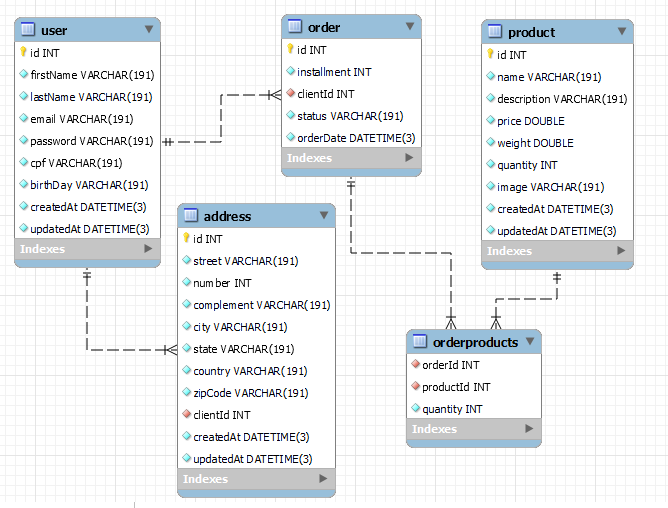

# Projeto API GraphQL Node.js Backend-Bagy

 O desenvolvimento do Projeto proposto neste documento é resultado da etapa de desafio técnico, que integra processo seletivo realizado pela Empresa Bagy.

## 🚀 Começando

As instruções abaixo descritas permitirão a execução integral deste projeto.

O projeto utiliza o [prisma](http://prisma.io) orm para a manipulação do banco de dados relacional. Nesta oportunidade, está sendo utilizado o banco SqLite3.

A `API GraphQL` utiliza o [Apollo-server](https://www.apollographql.com/docs/apollo-server/), rodando em http://localhost:4000

### 📋 Pré-requisitos

```
Para a execução deste projeto, se faz necessária a prévia instalação do SqLite3, na sua máquina.
```
Para mais detalhes de como instalá-lo, consulte a [página oficial](https://www.sqlite.org/download.html).

### Diagrama ER
Segue abaixo o Diagrama de Entidade e Relacionamento.



### 🔧 Instalação

Nesta sessão, vamos proceder com o passo a passo para a aplicação funcionar.

- Instalação das dependências do `projeto`:

```bash
yarn start
# ou
npm start
```
Usaremos o prisma para toda a manipulação do banco `sqlite3`

- Para executar as migrations:

```bash
yarn prisma migrate dev
# ou
npx prisma migrate dev
```

- Para qualquer alteração nas tabelas do banco com schema do `prisma`, caso necessário:
```bash
yarn prisma db push
# ou
npx prisma db push
```

## 📦 Desenvolvimento

Abaixo estão relacionadas as ferramentas que foram utilizadas para o desenvolvimento.

### 🛠️ Construído com

* [Node.js](https://nodejs.org/en/docs/) - Runtime javascript
* [JavaScript](https://developer.mozilla.org/pt-BR/docs/Web/JavaScript) - Linguagem
* [yarn](https://yarnpkg.com/) - Gerenciador de dependências
* [Prisma](http://prisma.io) - Orm Prisma
* [Apollo Server](https://www.apollographql.com/docs/apollo-server/) - Servidor que roda o GraphQL
* [GraphQL](https://graphql.org/) Linguagem query para a API

## ✒️ Autores

* **Marcelo Leite** - *Perfil Profissional* - [linkedin](https://www.linkedin.com/in/marsleite/)


## 🎁 Expressões de gratidão

* Obrigado a Bagy pela oportunidade de fazer este processo seletivo 🤓.
* Obrigado a Trybe pelo o ensino de qualidade.

---
Feito por [Marcelo Leite](https://github.com/marsleite) 😊
